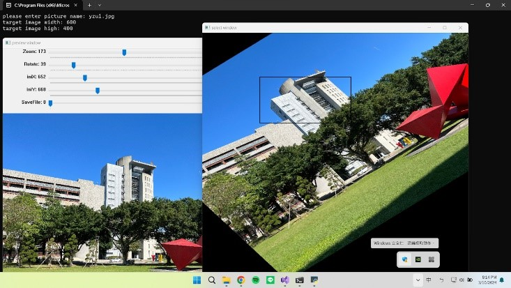
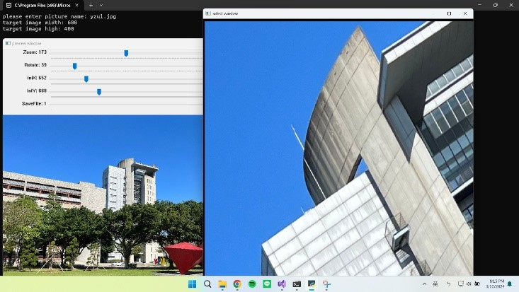
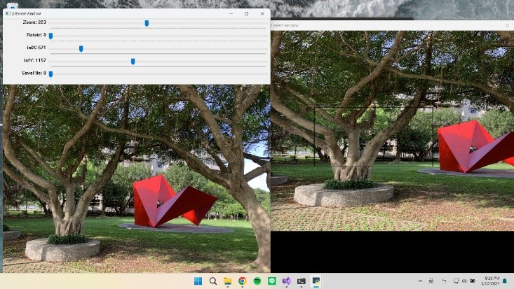
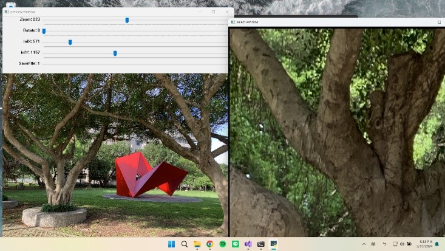

# Crop interested image area
圖像感興趣區域裁切、旋轉與縮放

專案目標：
撰寫一個 OpenCV 程式，讀取一張圖像，使用者可以從圖像選取一個感興趣的矩形區域，進行裁切、旋轉與縮放後儲存成一張新圖像。

情境模擬：
大雄正在設計一個關於元智大學的網頁，他拿手機在元智校園拍攝照片，作為介紹元智景點的素材。由於手機照片原始照片尺寸太大，且有些主題會只擷取照片的一個特定矩形區域來展示。

程式架構與功能說明：
1. 使用者從 Console 視窗輸入下列資料，來源照片檔案名稱(包含副檔名)及目標圖片尺寸的寬與高： 

2. 建立一個 preview window 顯示原始圖片，並設計 Trackbar 讓使用者調整圖像縮放比例、旋轉角度與目標矩形，並可儲存圖片。 (當原始照片解析度超過800*800時，視窗會自動調整至800*800)。

Zoom：縮放比例 
Rotate：旋轉角度 
iniX: 矩形左上點 x 座標 
iniY: 矩形左上點 y 座標 
SaveFile: 儲存檔案 

3. 利用一個 cropped window 顯示縮放與旋轉後影像，在上面用一個目標大小(如 600×400 像素)的黑色矩形，顯示目前區域讓使用者可以即時看到選取的目標圖像。

4. 使用者透過 preview window 的 trackbar 調整得到理想的目標圖像後，將 SaveFile trackbar 拖曳至 1 將圖片存成 crop.jpg。

成果展示與討論：

執行範例1：

執行範例2：

