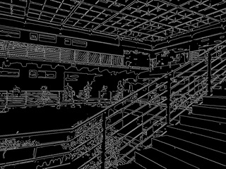

# Edge detection and thresholding
邊緣偵測與圖像二值化

專案目標：
撰寫一個 OpenCV 程式，讀取一張圖像，使用者可以獲得該圖像之黑白輪廓
線條圖案。

情境模擬：
靜香帶領一群幼稚園小朋友進行認識線條的活動，為了讓小朋友實際觀察元智大
學校園環境並將主要景物輪廓線條描繪出，她規劃利用影像處理課程所學習的邊緣偵
測(edge detection)與二值化演算法(thresholding)等技術，寫一個程式將所拍攝一些元智建築物與風景照片，處理後列印成一個繪本提供小朋友物件線條學習與臨摹。
 由於成本考量，靜香將以黑白圖案列印繪本。另一方面，考量到小朋友的年紀及本
次活動主題為認識線條圖案，希望輸出的結果包括明顯的景物線條如建築物或裝置藝
術外觀輪廓，而避免過多複雜邊緣如樹葉，草地的細節呈現等。

程式架構與功能說明：
1. 使用者從 Conslole 視窗輸入來源照片檔案名稱(包含副檔名) ：
please enter the file name:1.jpg
2. 建立一個 original window 顯示原始圖片，以及一個 after window 顯示處理完
後的圖片，並將圖片存到 output 目錄下的檔案 output.jpg。

成果展示與討論：

執行範例1：

執行範例2：

執行範例3：

執行範例4：

執行範例5：

