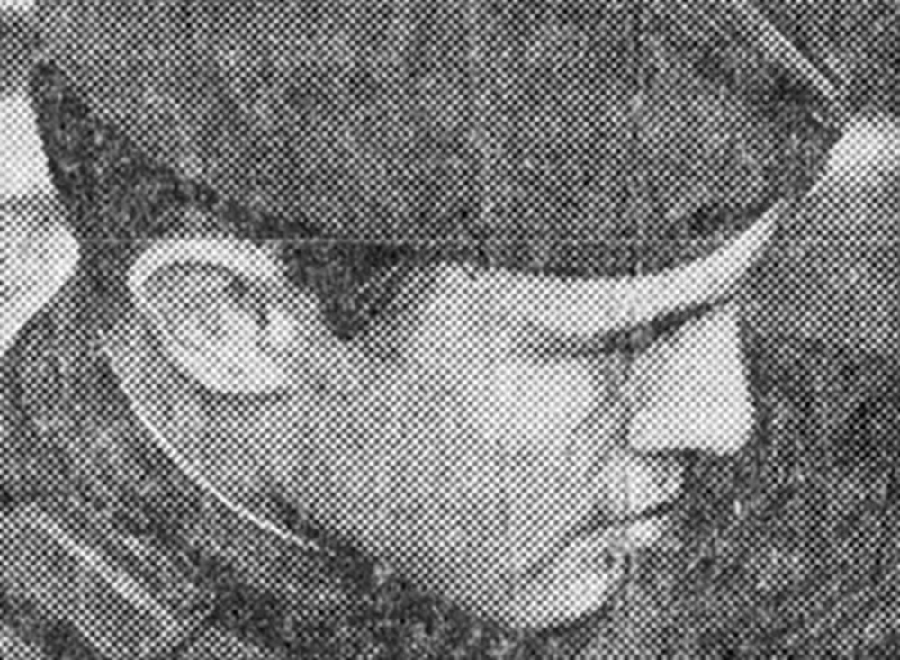
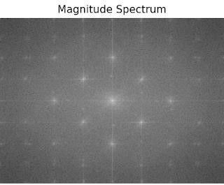
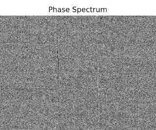
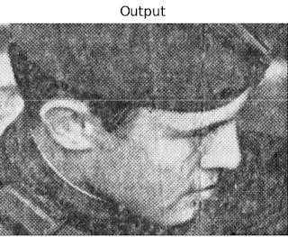
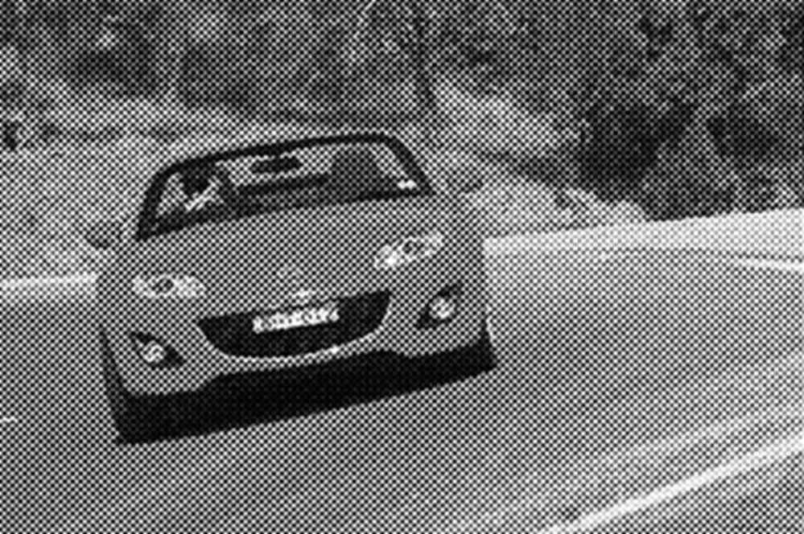
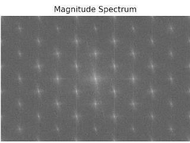
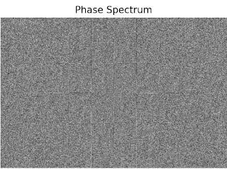
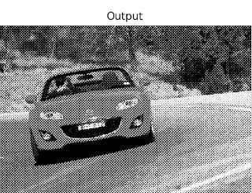

# Restore from noise
傅立葉轉換與影像復原處理

專案目標：  
撰寫一個 OpenCV 程式，讀取一張受干擾的圖像，盡可能地恢復圖片原始狀
態。

情境模擬：  
胖虎與正男正在進行荒野探險，並拍攝回兩張照片傳給小夫。由於影像在傳遞過
程受到雜訊干擾，使得圖片出現許些橫紋線條似的雜訊，小夫希望使用所學的頻域濾
波技術對這張影像進行處理，盡可能地恢復照片原始狀態呈現較清晰的景物，以便將照片刊登在著名的 CS362 荒野探險旅遊雜誌上。

程式架構與功能說明：
1. 使用者從 Console 視窗輸入來源照片檔案名稱(包含副檔名)

2. 建立一個 figure1 視窗，以顯示原始圖片、振幅譜、相位譜，以及恢復後的圖片，並將圖片存成 output.jpg。

成果展示與討論：

執行範例1：

執行範例2：

