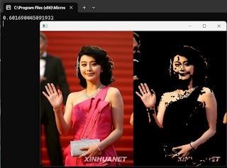
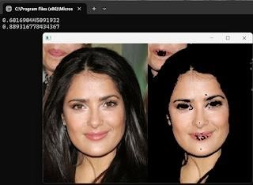
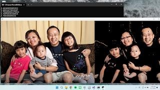
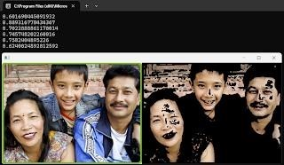
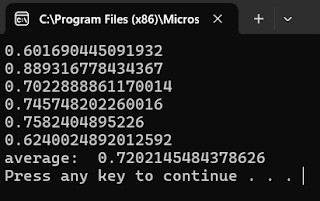

# Skin Color Detection
膚色偵測

專案目標：
撰寫一個程式來偵測照片中的皮膚顏色區域並將其標示出。使用附件中的6張照片及膚色標準答案(Ground Truth)做測試，並呈現所設計膚色偵測方法執行結果的IOU數值，及6個IOU數值之平均。

注意：
不能由人工對每張圖片分別調整參數。

程式架構與功能說明：
1. 程式會自動讀取路徑中的 picx.jpg 及 picx.png，總共執行 6 次迴圈。(x 為 1~6) 
2. 讀取圖片後，程式會偵測 jpg 檔的皮膚區域，並將非皮膚區域標示為黑色。 
3. 偵測結束後，將結果與 png 檔做比對，算出 IOU 數值。 
4. 顯示原圖、皮膚偵測之圖片、IOU 數值於螢幕上。當使用者關閉圖片視窗後，會顯示下一組結果。

成果展示與討論：

執行範例 1.

執行範例 2.

執行範例 3.

執行範例 4.

執行範例 5.

執行範例 6.

平均
