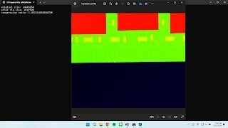
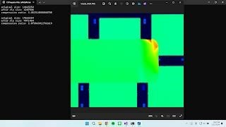
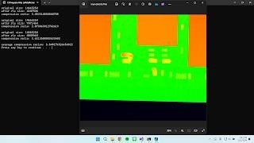

# Based Image Compression
影像壓縮練習

專案目標：  
附件中為三張利用將晶片高度以色彩視覺化後的圖片。請設計一個基於 Run-Length 的
壓縮法方，對圖檔作無失真壓縮後儲存成新檔案，並計算三張圖的平均壓縮率。

程式架構與功能說明：  
1. 程式會自動讀取路徑中的 imgx.bmp，總共執行 3 次迴圈。(x 為1~3) 
2. 讀取圖片後，程式會執行 img_to_array，將每像素的 rgb 抓出來。 
3. 接著執行 RLE，並於主程式將回傳結果存成 compressed_datax.bin。 (x 為 1~3) 
4. 接著執行 unzip，解壓縮以確認是否與原圖相同；並於螢幕秀出壓縮率、壓縮後圖片等資訊。 
5. 執行完 3 次迴圈後於螢幕秀出平均壓縮率。

成果展示與討論：

執行範例 1.  

執行範例 2.  

執行範例 3.  

