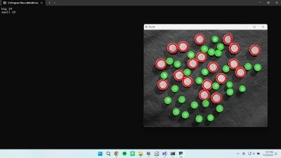

# Morphological Image Processing
數學形態學影像處理練習

專案目標：  
利用數學型態影像處理，計算附件圖片中的大、小木圓榫數量，並敘述方法與流程。

程式架構與功能說明：  
1. 程式會先將讀取之圖片轉為灰階，再已高斯慮波消除木圓榫內的雜訊、背景環境之雜訊。 
2. 對圖片進行二值化處理，以便於觀察結果。 
3. 對圖片先進行侵蝕，進一步消除雜訊；再膨脹，將被過度侵蝕之木圓榫盡可能恢復輪廓。 
4. 找到輪廓，並且透過大小木圓榫像素之差異，分別計算其數量、並放入不同 list。 
5. 將大木圓榫以紅色標示，小木圓榫以綠色標示；並顯示個別數量。

成果展示與討論：

