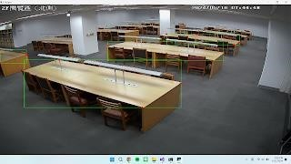

# Image Segmentation and Object Detection
影像分割及物件偵測

專案目標：  
撰寫一個程式來偵測出附件 2 張照片中的桌面區域與桌角。其中桌面區域需以矩形邊界框標示。

程式架構與功能說明：  
1. 程式會先將讀取之圖片轉為 hsv 格式，盡可能篩出桌面區域。 
2. 利用高斯模糊將雜訊模糊。 
3. 利用開運算消除雜訊、閉運算填補空隙。 
4. 找到輪廓，其中若輪廓之面積小於閾值，則不將其視為桌面區域。 
5. 大於閾值者會先算出近似輪廓，使多邊形盡可能地被視為矩形。再將有四個頂點的輪廓，繪製其矩形與頂點。

成果展示與討論：

執行範例 1.  

執行範例 2.  

